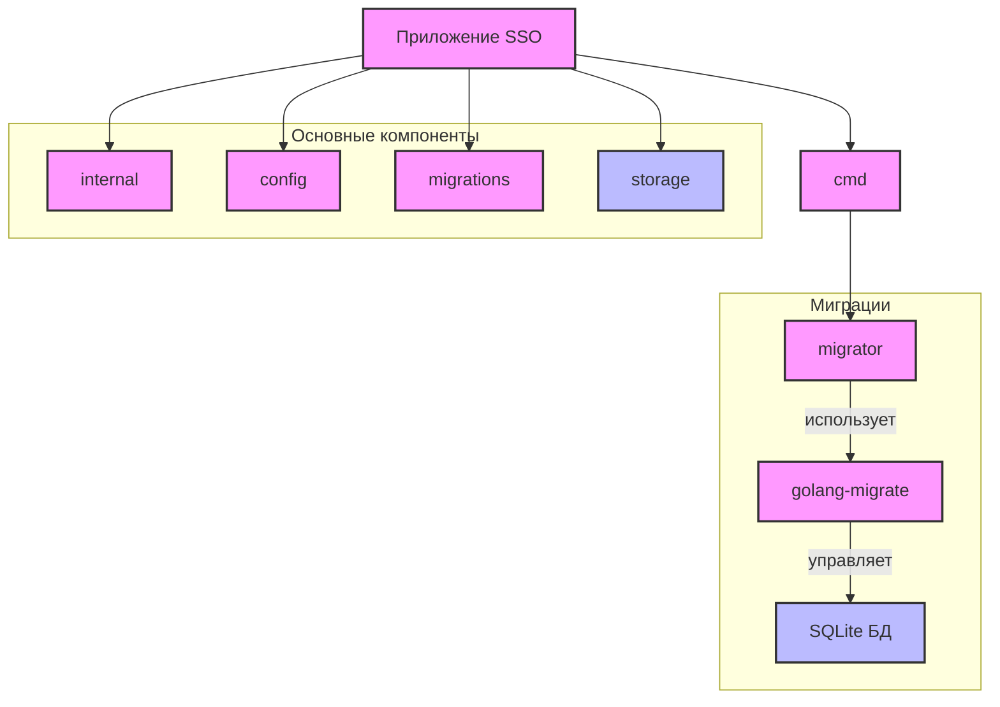

# Структура приложения SSO

## Основные компоненты

- `cmd/` - директория с исполняемыми файлами
  - `migrator/` - утилита для управления миграциями базы данных
- `internal/` - внутренний код приложения
- `config/` - конфигурационные файлы
- `migrations/` - файлы миграций базы данных
- `storage/` - хранилище данных (SQLite)

## Процесс миграции

1. Утилита migrator принимает параметры:
   - `storage-path` - путь к файлу БД
   - `migrations-path` - путь к директории с миграциями
   - `migrations-table` - название таблицы миграций (по умолчанию "migrations")

2. Использует библиотеку `golang-migrate` для:
   - Подключения к SQLite базе данных
   - Применения новых миграций
   - Отслеживания состояния примененных миграций

## Безопасность

- Внутренний код изолирован в директории `internal/`
- Конфигурация отделена от кода
- Использование миграций для контроля изменений в базе данных 